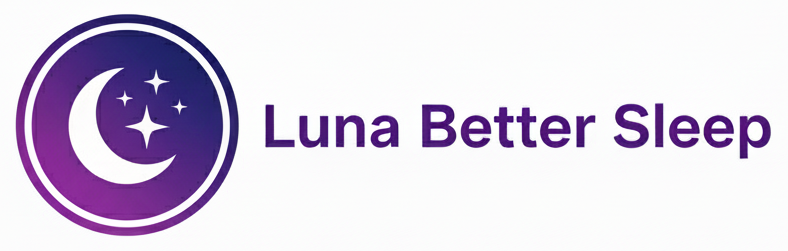

# Luna Better Sleep

Calm nights start with Luna Better Sleep, the curated sound companion crafted with pedagogues to help babies, kids, and adults fall asleep faster and stay asleep longer. Seamless loops, smart tools, and multilingual support turn bedtime into a peaceful ritual wherever you are.

---

## Why families choose Luna

- **70+ expertly mastered sounds** — From white, pink, and brown noise to rainstorms, ocean waves, heartbeat, womb sounds, lullabies, and binaural frequencies.
- **Personalized mixes** — Layer up to four tracks, fine-tune individual volumes, and save presets for nap time, bedtime, travel, or focus sessions.
- **Bedtime toolkit** — Smart sleep timers with gentle fade-outs, a compact mini player, and quick filters keep routines on schedule even in the middle of the night.
- **Global-friendly UI** — Instantly switch between English, Spanish, French, German, Italian, Dutch, and Turkish so the whole family feels at home.
- **Pedagogue curated** — Every sound in Luna’s library is handpicked with child development and sensory comfort in mind.

---

## Feature spotlight

### Curated sound library
Each track is engineered for seamless looping, balanced volume, and warm tones that soothe without distraction. New releases arrive monthly to keep your sleep toolkit fresh.

### Mix builder
Create custom soundscapes in seconds: combine rain with a low hum of white noise, sprinkle in lullabies, and save the blend for one-tap access tomorrow night.

### Smart sleep timers
Choose a duration and let Luna fade out gently once everyone drifts off. The mini player keeps quick controls within thumb’s reach while the screen stays dim.

### Multilingual experience
Tap the language selector to localize the entire interface. Favorites, search, and categories adapt instantly to the language you choose.

### Luna Premium
Unlock the full Luna experience with Premium: the entire sound catalog, offline listening for travel days, early access to new releases, and Apple Family Sharing support.

---

## Designed for every moment

| Scenario            | Luna Solution                                    |
|---------------------|---------------------------------------------------|
| Newborn settling    | Womb sounds, heartbeat, and gentle lullabies      |
| Toddler wind-down   | Low rain layers with soft pink noise              |
| Parent relaxation   | Ocean waves + binaural delta waves                |
| Focus sessions      | Brown noise + light instrumental pads             |
| Travel/jet lag      | Airplane cabin, fan, and timer-controlled mixes   |

---

## Get started in three steps

1. **Dive into the library** and preview curated collections such as Rainy Nights, Cozy Nursery, and Mindful Breaks.
2. **Save your go-to sounds** to Favorites so nap time and bedtime are always one tap away.
3. **Build a custom mix** tailored to each routine, then set a smart timer and let Luna handle the fade-out.

---

## Download & follow

- **App Store:** *(coming soon)*
- **Google Play:** *(coming soon)*

Stay in the loop for new sound drops, community tips, and sleep science insights.

---

## Need support?

Have a question or feature idea? Email us at [lunabettersleep@gmail.com](mailto:lunabettersleep@gmail.com). We’re always listening.

---

*Sweet dreams start with intentional sound. Luna Better Sleep is here to help your family rest, recharge, and wake up smiling.*
